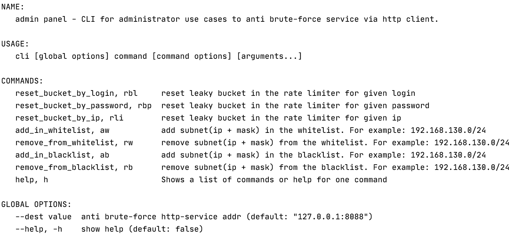

# Anti brute-force gRPC web service


[](https://travis-ci.com/github/teploff/antibruteforce)
[](https://codecov.io/gh/teploff/antibruteforce)
[](https://goreportcard.com/report/github.com/teploff/antibruteforce)

Сервис предназначен для борьбы с подбором паролей при авторизации в какой-либо системе, вызывается перед авторизацией пользователя и может либо разрешить, либо заблокировать попытку.
Предполагается, что сервис используется только для server-server, т.е. скрыт от конечного пользователя.

## Содержание

1. [ Описание. ](#desc)
2. [ Конфигурирование Rate Limiter-а. ](#usage)
3. [ Сборка и запуск проекта. ](#build)
    - [ Docker. ](#build-docker)
    - [ Makefile. ](#build-makefile)
4. [ CLI-админка. ](#cli-admin)
    - [ Конфигурирование. ](#config)
    - [ Запуск команд. ](#comm-launch)

<a name="desc"></a>
## 1. Описание
Сервис ограничивает частоту попыток авторизации для различных комбинаций параметров, а именно:
- не более N попыток в T1 единицу времени для данного логина;
- не более M попыток в T2 единицу времени для данного пароля (защита от обратного brute-force);
- не более K попыток в T3 единицу времени для данного IP.

Для подсчета и ограничения частоты запросов, использовался алгоритм [leaky bucket](https://en.wikipedia.org/wiki/Rate_limiting). Реализовано множество bucket-ов, по одному на каждый логин/пароль/ip. Bucket-ы храниться в памяти, для каждого из типов bucket-ов (логин/пароль/ip) предусмотрено время "протухания" **expire_time**. Реализован Bucket GC, который запускается с интервалом времени **gc_time** и отслеживает "протухшие" бакеты и удаляет их из памяти, что позволяет избежать утечек памяти.

Разработан command-line интерфейс для ручного администрирования сервиса, через который существует возможность вызвать сброс бакета и управлять whitelist/blacklist-ами. CLI работает через HTTP интерфейс.

White/black листы содержат списки адресов сетей, которые обрабатываются более простым способом:
Если входящий ip в whitelist, то сервис безусловно разрешает авторизацию;
Если - в blacklist, то отклоняет.

<a name="usage"></a>
## 2. Конфигурирование Rate Limiter-а
Для того, чтобы ограничить частоту попыток авторизации для конкретного типа bucket'a, например, логина, необходимо перейти в раздел конфигурации rate_limiter -> login. 
- **rate** - количество попыток
- **interval** - интервал времени, на котором действует ограничение. Величина соотвествует типу time.Duration
- **expire_time** - интервал времени, через который bucket считается "протухшим". Величина так же соотвествует типу time.Duration

Конфигурация для типов bucket'ов пароля и ip представляет идентичную стркутуру.

<a name="build"></a>
## 3. Сборка и запуск проекта

<a name="build-docker"></a>
## Docker
Сборка и запуск контейнеров:
```shell
git clone https://github.com/teploff/antibruteforce.git
cd deployments/stage
docker-compose up -d --build && docker image prune -f 
```
Остановка и удаление контенеров:
```shell
docker-compose down
docker system prune --volumes
```
<a name="build-makefile"></a>
## Makefile
Сборка сервиса:
```shell
git clone https://github.com/teploff/antibruteforce.git
make build
```

Запуск сервиса:
```shell
make run
```

Прогонка тестов:
```shell
make test
```

<a name="cli-admin"></a>
## 4. CLI-админка
Сборка и запуск c опции help:
```shell
make build_cli
./cli -help
```
Полное описание опции help для CLI:
<kbd>
    <p align="center">
      
    </p>
</kbd>

<a name="config"></a>
### Конфигурирование
Если необходимо указать явно destination адрес до anti brute-force сервиса, необходимо запускать binary-файл с флагом --dest
```shell script
./cli --dest 192.168.130.132:80
```

<a name="comm-launch"></a>
### Запуск команд
Команду можно запускать по полному имени, например:
```shell script
./cli reset_bucket_by_login teploff
```
Так и по ее alias:
```shell script
./cli rbl teploff
```

Полное описание команд можно увидеть выше или в разделе "COMMANDS", вызвав опцию --help или -h при запуске binary-файла.
